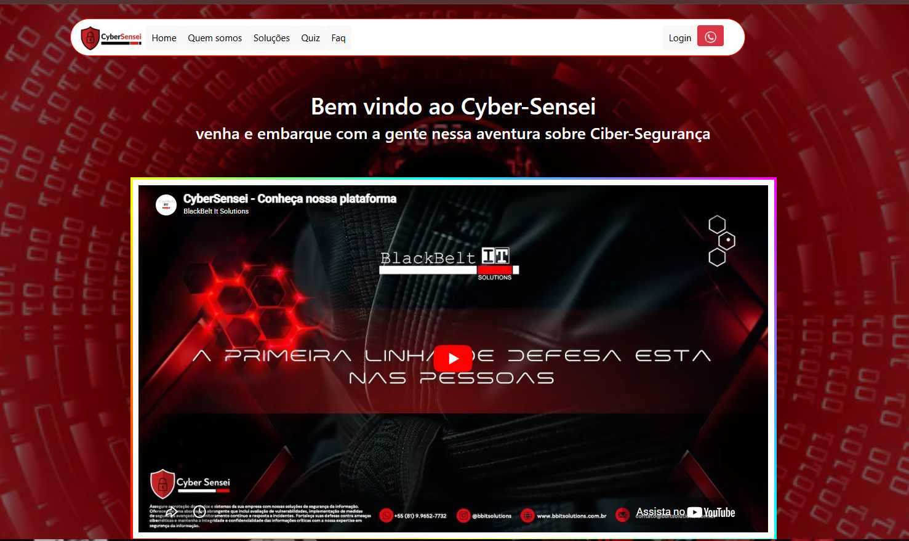

# 🚀 Meu Primeiro Hackathon - TECH TALK 🚀

Participei do meu primeiro Hackathon durante o evento **TECH TALK**, organizado pela **FICR**, em parceria com a **Cyber Sensei** e **Work Avanti**, em comemoração ao **Dia do Profissional de TI**.

Nosso desafio foi criar uma página web integrada à plataforma **Cyber Sensei**, com foco em cibersegurança e educação interativa. Mesmo sendo nosso primeiro contato com desenvolvimento web, conseguimos entregar um projeto funcional e educativo.

## 🔑 Principais Funcionalidades do Projeto

### Página Inicial Dinâmica
A página inicial do projeto apresenta uma interface amigável com informações sobre a Cyber Sensei e um vídeo educativo sobre segurança cibernética.

### Quiz Interativo de Cibersegurança
Desenvolvemos um quiz com perguntas sobre cibersegurança, cobrindo tópicos como:
- **Phishing**, **malware** e **engenharia social**.
- **Boas práticas de segurança**, como autenticação de dois fatores e uso de VPN.
- **Classificação de pontuação** baseada no desempenho do usuário.

### Sistema de Pontuação e Faixas
Os participantes são classificados com faixas de cores que representam seus conhecimentos em cibersegurança, de faixa branca a faixa preta.

## 🛠️ Tecnologias Utilizadas

- **HTML, CSS e JavaScript**: Para o desenvolvimento do front-end da página e do quiz interativo.
- **Bootstrap**: Para uma interface responsiva e moderna.
- **JavaScript Puro**: Manipulação das perguntas, respostas, pontuação e exibição dos resultados.

## 📸 Capturas de Tela do Projeto

### Página Inicial:
- Bem-vindo ao Cyber Sensei, com integração de vídeo explicativo e design responsivo.

### Quiz Interativo:
- Sistema de perguntas com múltipla escolha e classificação dinâmica de faixas.

### Sistema de Classificação:
- Visualização de faixas de conhecimento com imagens ilustrativas para cada nível de desempenho.

## 🌟 Lições Aprendidas

Durante o Hackathon, aprendi sobre:

- **Trabalho em equipe**: Colaborei com colegas do primeiro período para superar desafios técnicos e de comunicação.
- **Cibersegurança e LGPD**: Aprofundei meus conhecimentos em práticas de segurança e proteção de dados.
- **Gerenciamento de Projetos**: Concluímos o projeto dentro do prazo, mesmo com o curto tempo de desenvolvimento.

_"Cada desafio enfrentado foi uma oportunidade de aprender e crescer."_

Estou muito orgulhoso da nossa equipe pela determinação e esforço em entregar um projeto que, embora simples, trouxe uma experiência enriquecedora. 🚀
